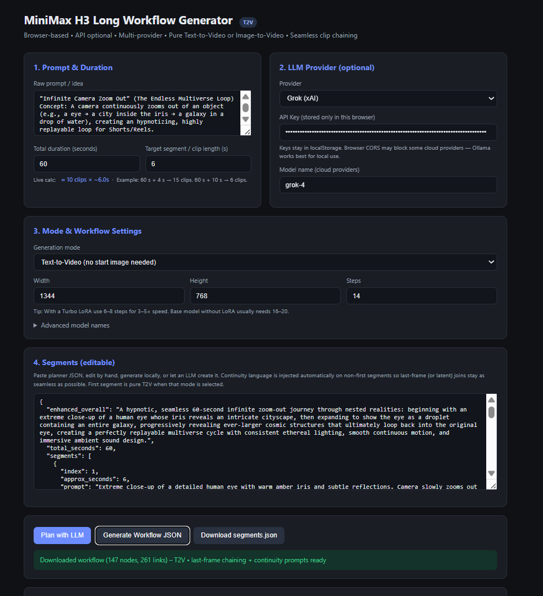
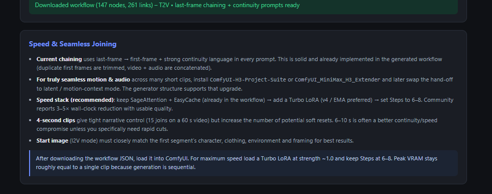

# MiniMax H3 Long Video – Hybrid Dynamic Workflow

Generate long MiniMax H3 videos by chaining short clips with strong continuity.

**Two ways to work:**

1. **Browser frontend (recommended for most users)** – single HTML file, zero install for planning + workflow generation.
2. **Python CLI** – original generator script for power users and automation.

Both produce the same ComfyUI workflow JSON with last-frame chaining, frame trimming, and audio/video concatenation.

---

## Browser Frontend (new)

**File:** [`MiniMax_H3_Long_Workflow_Generator.html`](MiniMax_H3_Long_Workflow_Generator.html)

Open the file in any modern browser. No Python, no server, no install required for the planner + workflow builder.

### Main UI



### Speed & Seamless Joining panel



### What the browser tool does

| Feature | Details |
|---------|---------|
| **Prompt + Duration** | Type a free-form idea. Set total length (e.g. 60 s) and target clip length (default **4 s** → 15 clips). Live calculator shows exact clip count. |
| **Local segment generator** | Provider = “None / Local generator” creates continuity-aware segments instantly (no API key). Every non-first clip starts with strong “Continue seamlessly… No reset, no cut, no fade” language. |
| **LLM planning (optional)** | Grok (xAI), OpenAI, Anthropic, or local Ollama. Same planner system prompt used by the Python path. |
| **T2V or I2V** | Pure Text-to-Video (first segment has no start image) or Image-to-Video (requires `start_frame.png` in ComfyUI input). |
| **Editable segments** | Full JSON editor. Continuity language is already injected. |
| **One-click workflow JSON** | Generates the complete ComfyUI graph (shared loaders, EasyCache, SageAttention, per-segment MiniMaxH3ImageToVideo + sampling + decode + last-frame hand-off + final join). |
| **Speed defaults** | Steps default to **8** (ready for Turbo LoRA). Tips panel explains 6–8 step + Turbo LoRA path for 3–5× speedups. |
| **Seamless joining guidance** | Built-in notes on last-frame chaining vs true latent/motion-context (Project Suite / Extender). |

### Quick browser workflow

1. Open `MiniMax_H3_Long_Workflow_Generator.html` in Chrome / Edge / Firefox.
2. Enter your video idea.
3. Set **Total duration** = 60 and **Target segment / clip length** = 4 (or whatever you prefer).
4. Click **Generate Segments (local)** (or switch provider and use an LLM).
5. Choose T2V or I2V, set resolution/steps if desired.
6. Click **Generate Workflow JSON** → download the `.json`.
7. Drag the JSON into ComfyUI, confirm the Start Image node (I2V only), queue.

The generated workflow already contains:

- Shared UNET / CLIP / VAEs + EasyCache + PathchSageAttentionKJ
- Per-segment conditioning → sampling → video + audio decode
- Last-frame extraction → next-segment first-frame link
- Duplicate-frame trimming on later segments
- Final ImageBatch + AudioConcat + CreateVideo + SaveVideo

---

## Files

| File | Purpose |
|------|---------|
| `MiniMax_H3_Long_Workflow_Generator.html` | **Browser frontend** – local + LLM segment planning, T2V/I2V, full workflow JSON generation |
| `docs/browser-ui-main.png` | Screenshot of the main browser UI |
| `docs/browser-ui-tips.png` | Screenshot of the Speed & Seamless Joining tips panel |
| `generate_h3_long_workflow.py` | Core Python generator (same node graph the browser emits) |
| `segments.json` | Example planner output |
| `PromptGen.md` | Additional prompt guidance |

---

## Prerequisites (ComfyUI side)

### ComfyUI
- Recent ComfyUI (0.30+ recommended for native MiniMax H3 support)
- Required custom nodes:
  - **KJNodes** (for `PathchSageAttentionKJ`)
  - Core nodes already include EasyCache, MiniMaxH3ImageToVideo, etc.

### Models (place in the usual ComfyUI folders)
```
models/diffusion_models/
  minimax_h3_fl2va_pruned_int8_convrot.safetensors

models/text_encoders/   (or clip/)
  qwen3vl_32b_heretic_minimax_h3_nvfp4.safetensors

models/vae/
  minimax_h3_video_vae_fp16.safetensors
  minimax_h3_audio_vae_fp32.safetensors
```

### Start image (I2V mode only)
Prepare a starting frame that matches the first segment (same character, clothing, environment, framing). Put it in ComfyUI’s input folder (e.g. `start_frame.png`).

---

## Python CLI path (still fully supported)

### 1. Create `segments.json`

Use the browser local generator, or paste the planner system prompt into Grok / Claude / etc., or write it by hand.

**Planner system prompt** (used by both browser and Python helper):

```text
You are an expert MiniMax H3 video director and prompt engineer. Your job is to turn a user's rough idea into a production-ready, shot-by-shot plan for continuous long-form video generation with seamless joins.

Rules:
1. Clean and enhance the overall concept for cinematic quality, consistent character/appearance/environment, and native audio.
2. Break the total duration into sequential segments whose length is close to the requested target_segment_seconds (normally 3–12 s).
3. Calculate the number of segments as ceil(total_seconds / target_segment_seconds).
4. For EVERY segment write an explicit, self-contained prompt that:
   - When it is NOT the first segment, MUST begin with strong continuity language:
     "Continue seamlessly from the supplied first frame. Preserve the same [character, clothing, environment, lighting, camera language and complete audio continuity]. No reset, no cut, no fade."
   - Uses the structured H3 style: integrated_multimodal_description, overall_soundscape, non_diegetic_music, tracking/camera notes.
   - Keeps identity, wardrobe, environment, lighting and camera language consistent.
5. Output ONLY valid JSON in this exact schema (no markdown, no commentary).
```

### 2. Generate the ComfyUI workflow

```bash
python generate_h3_long_workflow.py \
  --segments segments.json \
  --output minimax_long_60s.json \
  --start-image start_frame.png \
  --width 768 \
  --height 1344 \
  --steps 8
```

(Use `--steps 8` when a Turbo LoRA is loaded; otherwise 16–20 for the base model.)

### 3. Load into ComfyUI

1. Open ComfyUI.
2. Load the generated `.json`.
3. Confirm the Start Image node (I2V) points to your actual start frame.
4. Queue the prompt.

The workflow will generate each segment sequentially, feed the last frame of segment N into segment N+1, trim the duplicate first frame, concatenate video + audio, and save both individual segments and the final long video.

---

## Speed recommendations

| Lever | Typical gain | Notes |
|-------|--------------|-------|
| **Turbo LoRA** (v4 / EMA preferred) | 3–5× on sampling | Drop steps to 6–8. Strength ≈ 1.0. |
| **SageAttention / PathchSageAttentionKJ** | 1.5–2× | Already wired in every generated workflow. |
| **EasyCache** | Extra 10–30 % | Already present. |
| **Shorter draft resolution** | Large | Iterate at 480–640p, final at 768×1344. |

Peak VRAM stays roughly equal to a single clip because generation is sequential.

---

## Seamless joining notes

- **Current method**: last-frame → first-frame + aggressive continuity language in every prompt. Works well and is what both the browser and Python generators emit.
- **Better continuity**: install `ComfyUI-H3-Project-Suite` or `ComfyUI_MiniMax_H3_Extender` and later swap the hand-off to latent / motion-context mode. The generator structure is designed to make that upgrade straightforward.
- **4-second clips** give tight control (15 joins on a 60 s video) but create more potential soft resets. 6–10 s is often a better continuity/speed compromise.

---

## Important Notes

### Start image matching (I2V)
The first segment is conditioned on the start image. For best results the start image should already look like the beginning of the first prompt (same person, clothing, environment, camera angle).

### Frame length
MiniMax H3 snaps duration to the `17k + 5` grid at 24 fps. Both generators automatically compute valid lengths.

### Seeds
By default seeds are fixed and offset per segment (`base + i * 9973`).

---

## Troubleshooting

| Symptom | Likely cause | Fix |
|---------|--------------|-----|
| Identity changes between segments | Weak continuity language or mismatched start image | Use the browser local generator (it injects strong continuity) and match the start frame |
| OOM | Segment too long / resolution too high | Lower duration per segment or resolution |
| Audio cuts at joins | Expected with last-frame method | Acceptable for now; latent continuity packs improve this |
| Model not found | Filename mismatch | Check exact filenames in your models folders |

---

## Next Upgrades (optional)

- Swap the conditioning/sampling section to use H3 Project Suite latent context nodes for true motion + audio continuity.
- Deeper Turbo LoRA integration (automatic LoRA loader node).
- Multi-GPU segment parallelization (advanced).

---

**Browser frontend is the fastest way to go from idea → continuity-aware segments → ready-to-queue ComfyUI workflow.**  
Open `MiniMax_H3_Long_Workflow_Generator.html` and start generating.
